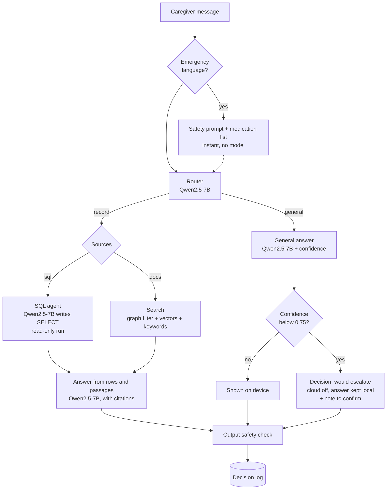

# Architecture

CareEdge runs entirely on one HP ZGX Nano (NVIDIA GB10, 128 GB unified memory). Two open-weight models, served by ZRT (vLLM) through its proxy, do all of the AI work; SQLite files hold the data.

## Components

| Component | Technology | Port or file |
|---|---|---|
| Chat model | Qwen2.5-7B-Instruct, served with ZRT as `careedge-llm` | ZRT proxy (8080) |
| Embedding model | Qwen3-Embedding-0.6B (1,024-dimension vectors), served with ZRT as `careedge-embed` | ZRT proxy (8080) |
| Web app | Streamlit | 8501 |
| Patient database | SQLite: residents, medications, appointments, vitals | `data/patient.db` |
| Document store | SQLite: documents, sections with vectors, graph nodes and edges | `data/rag.db` |
| Decision log | SQLite: every routing and escalation decision | `data/events.db` |

## Flow 1: questions



- **Record questions** use SQL for structured facts (medications, times, allergies, appointments, vitals, questions across all residents) and document search for narrative (why something happened, care-plan instructions, shift notes, policies). The router picks one or both; summaries use both.
- **General requests** never see resident records.
- **Every answer** passes the output safety check before it is shown, and every decision is logged.

## Flow 2: uploads

```mermaid
flowchart TD
  up[PDF or TXT upload] --> text{Page has<br/>a text layer?}
  text -->|yes| ext[Extract text<br/>pypdfium2]
  text -->|no, scanned| vis[Vision model reads<br/>the page image<br/>(needs a vision model)]
  ext --> meta[Qwen2.5-7B reads title, type,<br/>patient name, DOB, medications,<br/>doctors, conditions]
  vis --> meta
  meta --> match{Name and DOB match<br/>exactly one resident?}
  match -->|yes| auto[Attach automatically]
  match -->|no| ask[Caregiver confirms]
  match -->|policy| fac[Facility document]
  auto --> store[Split into sections, embed<br/>Qwen3-Embedding]
  ask --> store
  fac --> store
  store --> vec[(Vector store)]
  store --> graph[(Graph links)]
  store --> rec[Compare medications<br/>with the record]
  rec --> flag[Flag differences<br/>for the nurse]
```

## The document store: vectors and graph

The graph works like a social network: each resident is a profile, each document is a post on that profile, and the medications, doctors and conditions it mentions are tags.

```
patient ──HAS_DOCUMENT──▶ document ──MENTIONS──▶ medication | doctor | condition
```

| Table | Contents |
|---|---|
| `documents` | File, title, type, resident (empty for facility policies), how it was read, how it was matched, medication flags |
| `chunks` | One row per section: page, heading, text prefixed with its title and resident, and its embedding |
| `nodes` | patient, document, medication, doctor, condition |
| `edges` | `HAS_DOCUMENT` and `MENTIONS` links |

Search uses the graph first (the resident's documents plus facility policies), then scores each section by cosine similarity plus a keyword boost (so exact doses and drug names count). The graph also powers the Patients page view of everything connected to a resident.

The graph is two tables in SQLite rather than a separate graph database. At this scale that gives the same relationships without another service to run; it could move to a graph database later without changing the flows.

## The patient database

| Table | Key columns |
|---|---|
| `residents` | name, date of birth, age, room, conditions, allergies (summary), primary doctor |
| `allergies` | resident, allergen, reaction, severity, what to avoid, medication on file |
| `medications` | resident, drug, dose, route, times, purpose, status (active or stopped), start and end date, prescriber |
| `appointments` | resident, date, time, type, provider, location |
| `vitals` | resident, date, blood pressure, pulse, oxygen saturation, glucose |

Model-written SQL runs through `patient_db.run_readonly()`: read-only connection, an authorizer that allows only reads of these five tables, single SELECT statements, a row limit and a time limit.

## Memory on the Nano

| Process | Share of unified memory |
|---|---|
| Qwen2.5-7B-Instruct (weights about 15 GB, plus KV cache) | 40% (`--gpu-memory-fraction 0.4`) |
| Qwen3-Embedding-0.6B | 5% |
| Operating system, app, databases | the rest |

We first tried Qwen2.5-7B-27B NVFP4 (24.2 GB of weights). It loaded, but the Linux out-of-memory handler killed it during vLLM's GPU kernel compilation at startup, with the embedding model running alongside. See "Model choice" in the README.
